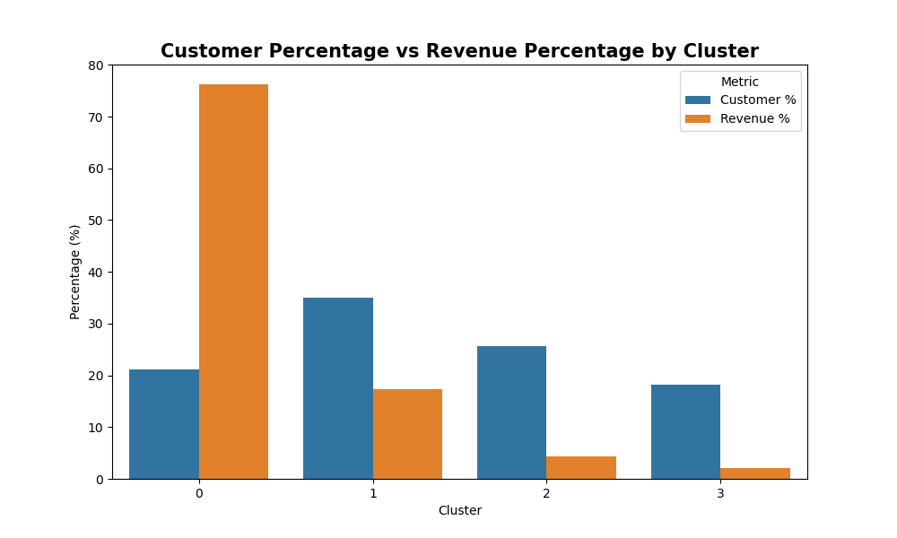

# Customer Behavior Analysis using RFM and K-Means Clustering

## Project Overview

This project analyzes customer purchasing behavior using the Online Retail II dataset and applies customer segmentation techniques based on RFM (Recency, Frequency, Monetary) metrics and K-Means clustering.

The objective is to identify groups of customers with similar purchasing patterns and generate actionable business recommendations to support customer retention and marketing decision-making.

The project simulates the work of a Junior Data Analyst supporting CRM and Marketing teams by transforming transactional data into business insights.

---

## Business Context

The dataset corresponds to a UK-based online retail company that sells unique giftware products primarily through an online channel. A significant portion of customers are wholesalers, resulting in heterogeneous purchasing patterns and spending behaviors.

Understanding customer behavior is essential for:

* Improving customer retention.
* Identifying high-value customers.
* Optimizing marketing campaigns.
* Increasing customer lifetime value.
* Supporting data-driven decision making.

---

## Business Questions

This project aims to answer the following questions:

* How are customers distributed according to their Recency, Frequency and Monetary value?
* What customer segments can be identified based on purchasing behavior?
* What percentage of total revenue is generated by the most valuable customers?
* Are there customers with high purchasing frequency but relatively low spending?
* Which customer groups should be prioritized for retention strategies?
* Which customer groups require reactivation campaigns?

---

## Dataset

**Dataset:** Online Retail II

The dataset contains transactional records between December 2009 and December 2011.

### Main Variables

| Variable    | Description            |
| ----------- | ---------------------- |
| Invoice     | Transaction identifier |
| StockCode   | Product identifier     |
| Description | Product name           |
| Quantity    | Quantity purchased     |
| InvoiceDate | Transaction date       |
| Price       | Unit price             |
| Customer ID | Customer identifier    |
| Country     | Customer country       |
| TotalPrice  | Quantity × Price       |

---

## Tools and Technologies

* Python
* Pandas
* NumPy
* Matplotlib
* Seaborn
* Scikit-Learn
* Jupyter Notebook

---

## Project Workflow

### 1. Business Understanding

* Business context analysis.
* Definition of analytical objectives.
* Identification of business questions.
* Customer retention focus.

### 2. Data Understanding and Cleaning

* Data quality assessment.
* Removal of cancelled transactions.
* Removal of transactions with missing customer IDs.
* Duplicate detection and removal.
* Cleaning process automation using Python scripts.

### 3. Exploratory Data Analysis (EDA)

* Descriptive statistics.
* Variable distribution analysis.
* RFM metric exploration.
* Pareto analysis of customer revenue contribution.

### 4. RFM Analysis and Pre-Clustering

* RFM metric calculation.
* Logarithmic transformation.
* Feature scaling and normalization.
* Outlier impact reduction.

### 5. Customer Segmentation

* Elbow Method.
* Silhouette Score validation.
* K-Means clustering implementation.
* Cluster visualization in 2D and 3D spaces.

### 6. Business Interpretation

* Customer segment characterization.
* Revenue contribution analysis.
* Customer behavior interpretation.
* Strategic recommendations.

---

## Project Structure

```text
customer-behavior-analysis-rfm-kmeans/

├── data_clean/
│ 
├── data_raw/  
│
├── notebooks/
│   ├── 01_context_project_objectives.ipynb
│   ├── 02_data_understanding and cleaning.ipynb
│   ├── 03_eda.ipynb
│   ├── 04_rfm_analysis.ipynb
│   ├── 05_clustering.ipynb
│   └── 06_business_interpretation.ipynb
│
├── src/
│   ├── data_cleaning.py
│   ├── rfm_construction.py
│   ├── k-means_clustering.py
│
├── figures/
│
├── requirements.txt
└── README.md
```

---

## Key Visualizations

### Exploratory Data Analysis

#### RFM Metrics Original Distributions

<p align="center">
  
</p>

This visualization reveals the strong skewness and presence of extreme values in customer purchasing behavior.

#### Pareto Analysis

<p align="center">
  
</p>

The analysis shows that approximately 10% of customers generate 64% of the company's revenue, indicating the existence of a high-value customer segment.

---

### Customer Segmentation

#### Elbow Method

<p align="center">
  
</p>

Used to determine the optimal number of clusters for the K-Means algorithm.

#### Silhouette Score

<p align="center">
  
</p>

Used to validate cluster quality and separation.

#### Customer Segments (2D Visualization)

<p align="center">
  
</p>

#### Customer Segments (3D Visualization)

<p align="center">
  
</p>

---

### Business Insights

#### Average RFM Metrics by Cluster

<p align="center">
  
</p>

#### RFM Radar Comparison

<p align="center">
  
</p>

#### Customer Percentage vs Revenue Percentage

<p align="center">
  
</p>

#### RFM Distribution by Cluster

<p align="center">
  
</p>

---

## Key Findings

* Four customer segments were identified using K-Means clustering.
* Cluster 0 represents approximately 21% of customers but generates around 76% of total revenue.
* Cluster 1 contains the largest number of customers and represents the company's typical customer profile.
* Cluster 2 contains inactive customers with very high recency values, suggesting potential churn.
* Cluster 3 consists of active but low-value customers with low purchase frequency and spending.
* Customer revenue distribution follows a Pareto-like pattern where a small proportion of customers generates the majority of revenue.

---

## Customer Segments

### Cluster 0 — High-Value Customers

**Characteristics**

* Lowest recency.
* Highest purchase frequency.
* Highest monetary contribution.

**Business Strategy**

* Loyalty programs.
* Personalized recommendations.
* VIP campaigns.
* Customer retention initiatives.

---

### Cluster 1 — Regular Customers

**Characteristics**

* Moderate recency.
* Moderate frequency.
* Moderate spending.

**Business Strategy**

* Product bundles.
* Personalized promotions.
* Seasonal campaigns.
* Upselling initiatives.

---

### Cluster 2 — Lost Customers

**Characteristics**

* Highest recency.
* Low frequency.
* Low spending.

**Business Strategy**

* Reactivation campaigns.
* Win-back offers.
* Customer feedback collection.
* Retargeting campaigns.

---

### Cluster 3 — Low-Value Active Customers

**Characteristics**

* Recent activity.
* Low purchase frequency.
* Low monetary value.

**Business Strategy**

* Promotional campaigns.
* Product recommendations.
* Engagement initiatives.

---

## Business Recommendations

Based on the identified customer segments, the company should:

* Develop differentiated CRM strategies for each customer segment.
* Prioritize retention efforts for high-value customers.
* Implement reactivation campaigns for inactive customers.
* Optimize marketing spending according to customer value.
* Monitor customer behavior using RFM metrics regularly.

### Suggested KPIs

* Customer Retention Rate
* Churn Rate
* Customer Lifetime Value (CLV)
* Repeat Purchase Rate
* Average Order Value (AOV)
* Revenue Contribution by Segment
* Promotion Conversion Rate

---

## How to Run the Project

### 1. Clone Repository

```bash
git clone https://github.com/your-username/customer-behavior-analysis-rfm-kmeans.git
```

### 2. Create Virtual Environment

```bash
python -m venv venv
```

### 3. Activate Environment

Windows

```bash
venv\Scripts\activate
```

Mac/Linux

```bash
source venv/bin/activate
```

### 4. Install Dependencies

```bash
pip install -r requirements.txt
```

### 5. Execute Notebooks Sequentially

```text
01_context_project_objectives.ipynb
02_data_understanding.ipynb
03_data_cleaning.ipynb
04_eda.ipynb
05_rfm_analysis.ipynb
06_clustering_kmeans.ipynb
07_business_interpretation.ipynb
```

---

## Future Improvements

* Customer Lifetime Value (CLV) modeling.
* Cohort Analysis.
* Churn Prediction models.
* Market Basket Analysis.
* Recommendation Systems.
* Interactive dashboards using Power BI or Tableau.

---

## Author

Data Analytics Portfolio Project focused on Customer Segmentation, RFM Analysis and K-Means Clustering.

Developed as part of a professional portfolio to demonstrate data cleaning, exploratory analysis, customer analytics, machine learning and business-oriented decision making.
